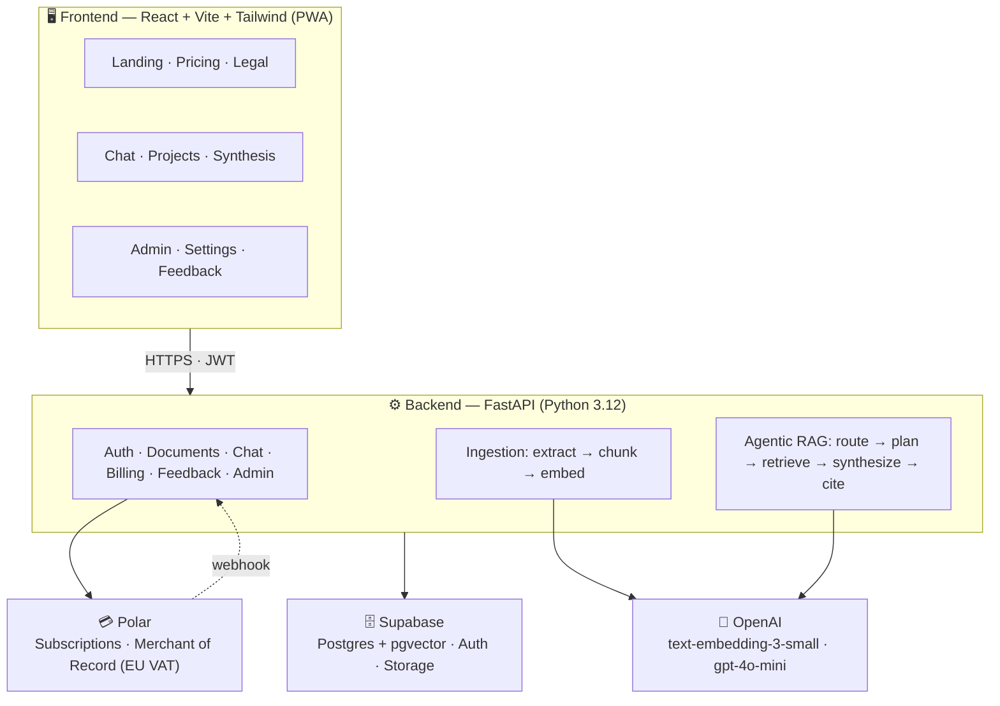
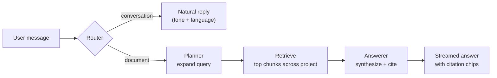

<div align="center">

# 📄 Foliq

### Your research library that thinks.

**Ask across _all_ your papers, not one at a time.**

Foliq is an agentic RAG application that turns a growing collection of documents into a
persistent, queryable research library — with cross-paper synthesis and citations to the
exact page. Built for researchers and students, it works for any document.

`React` · `FastAPI` · `Supabase` · `OpenAI` · `Polar`

</div>

---

## What makes Foliq different

A general chatbot forgets your papers between chats. Foliq **remembers your whole library
and reasons across it** — the way a literature review actually works. Ask where your sources
agree, where they conflict, which support a claim, or what's missing, and get one answer
synthesized across the entire collection, each point cited to the exact paper and page.

That persistent-collection synthesis is something a stateless chatbot structurally can't do,
and it's the core wedge of the product.

---

## Architecture



**Request lifecycle.** The React frontend calls the FastAPI backend over HTTPS with a Supabase
JWT. Uploads run through an **ingestion pipeline** (extract text → chunk → embed → store vectors
in pgvector). Questions run through an **agentic RAG pipeline** — a router decides if the message
needs the documents or is just conversation; a planner expands the query; retrieval pulls the most
relevant chunks across the whole project; an answerer synthesizes a cited response. Billing runs
through Polar, whose signed webhook is the source of truth for a user's plan.

---

## Tech stack

| Layer | Technology |
|---|---|
| **Frontend** | React 18, Vite, Tailwind CSS, React Router |
| **Backend** | FastAPI, Python 3.12, Pydantic |
| **Database** | Supabase — Postgres + `pgvector` (HNSW index), Auth, Storage |
| **AI** | OpenAI `text-embedding-3-small` (1536-dim) + `gpt-4o-mini` |
| **Billing** | Polar (Merchant of Record — handles EU VAT) |
| **Mobile** | Installable PWA (service worker + web manifest) |

---

## Features

### 🔬 Research & synthesis (the core)
- **Persistent projects** — each project is a growing library of documents you return to over time.
- **Cross-paper synthesis** — ask across the whole collection: agreements, conflicts, gaps, and thematic overviews, each point attributed to its source.
- **Exact citations** — every claim links to the source document and page, rendered as interactive citation chips (hover to see the excerpt).
- **Agentic RAG** — a router classifies each message, a planner expands the query, retrieval spans the project, and the answerer stays grounded in retrieved chunks (no hallucinated facts).

### 👤 Profession-aware experience
On first login the user picks a profession, which tailors the whole app. Each gets its own
one-click action bar (shown only when a project has 2+ documents):

| Profession | One-click actions |
|---|---|
| **Researcher** | Find agreements · Find conflicts · Spot gaps · Summarize the landscape |
| **Student** | Explain simply · Key concepts · Quiz me · Make study notes |
| **Professional** | Summarize key points · Extract action items · Find red flags · Compare documents |
| **Something else** | Clean, direct chat — no extra buttons |

### 📁 Documents
- **Multi-format upload** — PDF, Word (`.docx`), PowerPoint (`.pptx`), Excel (`.xlsx`), CSV, text, and Markdown, each extracted with meaningful location tracking (page / slide / sheet).
- **Unified upload grid** — upload new files _and_ reuse previous documents in one action, with staged uploads and a scrollable list.
- **Chat-scoped documents** — each project only searches its own library; the same document can be reused across projects.

### 💬 Conversational intelligence
- **Natural chat** — greetings, small talk, and general questions are handled conversationally; document retrieval only kicks in when you actually ask about your documents.
- **Tone picker** — Casual / Professional / Humorous.
- **Regional languages** — answer in Hindi, Tamil, Telugu, Kannada, Malayalam, Marathi, Bengali, Gujarati, plus Spanish, French, German, Arabic — even when the document is in English.

### 🔐 Accounts & auth
- Email/password auth via Supabase, with persistent sessions (refresh-token rotation) and email-confirmation support.
- Nickname + profession profile, editable anytime in Settings.
- Full data controls: export your data, delete all projects, or permanently delete your account.

### 💳 Billing (Polar)
- **Free vs Pro** tiers with enforced limits (documents, file size, pages, monthly questions) and friendly in-context upgrade prompts.
- Polar-hosted checkout + **signature-verified webhook** as the source of truth for plan changes.
- Merchant-of-record model handles **EU VAT** automatically.

### 📊 Admin & feedback
- **Aggregate-only admin dashboard** (gated by `ADMIN_EMAILS`) — total users, Pro/Free split, document counts, storage, file-type breakdown, and feedback. **Never exposes users' document contents**, honoring the privacy promise.
- **In-app feedback** — star rating + comment, stored and surfaced in the admin panel.

### 🎨 Polish
- Light / dark mode across the whole app.
- Distinctive "ink & iris" design system (Fraunces + Inter, amber citation chips).
- Responsive landing page with scroll-reveal animations.
- **Installable PWA** — "Add to Home Screen" on mobile, works offline for the app shell.
- Privacy Policy, Cookie Policy, and a cookie-consent banner.

---

## Project structure

```
foliq/
├── backend/
│   └── app/
│       ├── main.py                 # FastAPI app + router registration
│       ├── config.py               # settings + admin check
│       ├── deps.py                 # auth dependency (JWT → user)
│       ├── core/
│       │   ├── supabase_client.py  # DB/storage + admin client
│       │   └── polar_client.py     # Polar SDK config
│       ├── models/                 # Pydantic request/response shapes
│       ├── prompts/                # router, planner, answerer, conversation, synthesis
│       ├── routers/                # auth, documents, chat, account, billing, feedback/admin
│       └── services/               # ingestion, extractors, embeddings, retrieval,
│                                   #   agent (RAG orchestration), storage, billing, auth
├── frontend/
│   └── src/
│       ├── pages/                  # Landing, Login, Chat, Pricing, Legal, AdminPanel
│       ├── components/             # chat, documents, layout, onboarding, ui
│       ├── hooks/                  # useAuth, useTheme, useResearchMode, useUpload
│       └── api/                    # thin API clients
├── supabase/
│   ├── schema.sql                  # base tables + match_chunks() + HNSW index
│   ├── rls_policies.sql            # row-level security
│   ├── storage_policies.sql        # storage bucket policies
│   ├── migration_*.sql             # chat scoping, profile fields, billing + feedback
│   └── email_templates/            # branded confirmation email
└── README.md
```

---

## Getting started

### Prerequisites
- **Python 3.11 or 3.12** (not 3.14 — some dependencies lack prebuilt wheels for it)
- **Node.js 18+**
- A **Supabase** project, an **OpenAI** API key, and (optional) a **Polar** account

### 1. Supabase
Create a project, then run the SQL files in the Supabase SQL editor **in order**:
```
schema.sql → rls_policies.sql → storage_policies.sql
→ migration_chat_documents.sql → migration_profile_fields.sql
→ migration_billing_feedback.sql
```
Create a Storage bucket for documents. For local dev you can turn off "Confirm email";
turn it back on (and paste `email_templates/confirm_signup.html` into the Confirm-signup
template) before going live.

### 2. Backend
```bash
cd backend
python -m venv .venv && source .venv/bin/activate   # Windows: .venv\Scripts\activate
pip install -r requirements.txt
```
Create `backend/.env`:
```env
SUPABASE_URL=https://<project>.supabase.co
SUPABASE_SERVICE_KEY=<service-role-key>
SUPABASE_ANON_KEY=<anon-key>
OPENAI_API_KEY=sk-...
ADMIN_EMAILS=you@example.com
# Optional — billing activates once these are set:
POLAR_ACCESS_TOKEN=polar_...
POLAR_PRODUCT_ID=...
POLAR_WEBHOOK_SECRET=...
POLAR_SERVER=sandbox
POLAR_SUCCESS_URL=http://localhost:5173/chat?checkout=success
```
Run it:
```bash
uvicorn app.main:app --reload
```

### 3. Frontend
```bash
cd frontend
npm install
```
Create `frontend/.env`:
```env
VITE_ADMIN_EMAILS=you@example.com
```
Run it:
```bash
npm run dev
```
Open http://localhost:5173.

---

## Agentic RAG pipeline



1. **Route** — is this a document question or just conversation?
2. **Plan** — expand the question into focused sub-queries.
3. **Retrieve** — pull the most relevant chunks across the whole project (pgvector similarity).
4. **Synthesize** — answer using only retrieved excerpts, noting agreements / conflicts / gaps across sources.
5. **Cite** — attach a citation to every claim, pointing at the exact document and page.

---

## Security & privacy

- Documents are scoped per user and per project; retrieval never crosses accounts.
- The admin dashboard is **aggregate-only** and never exposes document contents.
- Payments are handled by Polar — card details never touch Foliq's servers.
- Row-level security policies enforce per-user data isolation in Postgres.

---

<div align="center">

Built as a full-stack portfolio project — agentic RAG, subscriptions, admin analytics, and PWA.

© Foliq

</div>